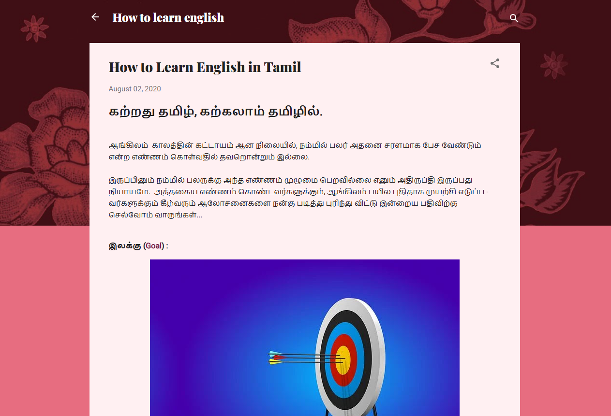
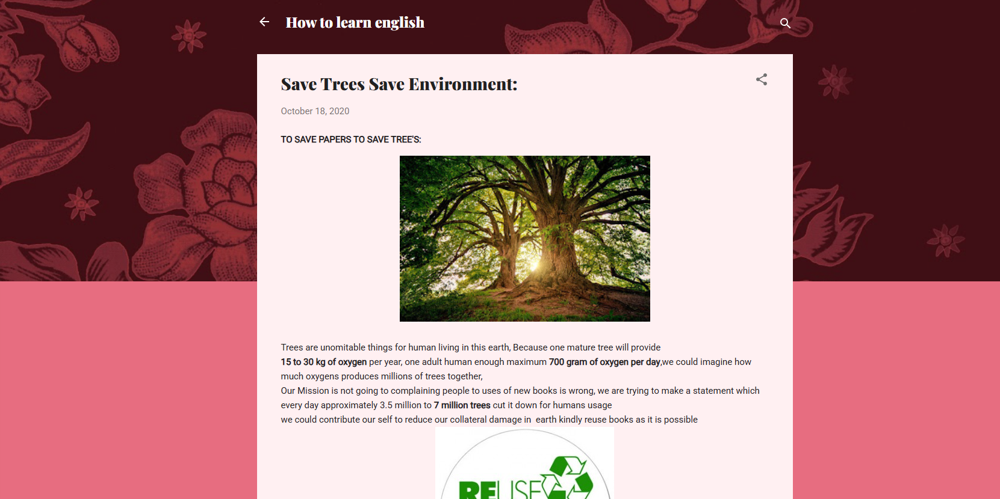

# My Blogger Portfolio

I created blogs on various topics using Blogger to share knowledge and awareness.  

---

## 1. How to Learn English in Tamil
**Description:** A step-by-step guide to help Tamil speakers learn English effectively.  
  
**Link:** [Read Blog](https://cmkrss007.blogspot.com/2020/08/how-to-learn-english-in-tamil.html)

---

## 2. Save Trees, Save Environment
**Description:** An article emphasizing the importance of trees and protecting the environment.  
  
**Link:** [Read Blog](https://cmkrss007.blogspot.com/2020/10/save-trees-save-environment.html)
